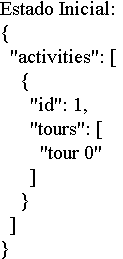
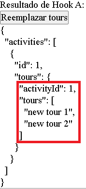
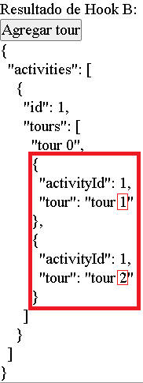
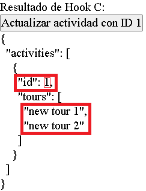
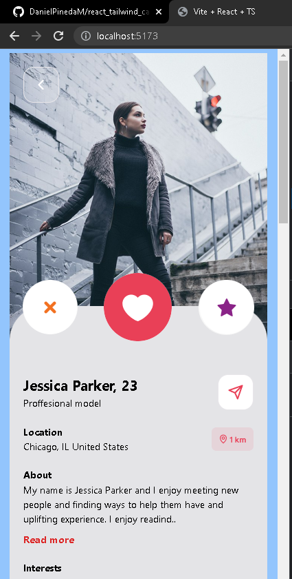
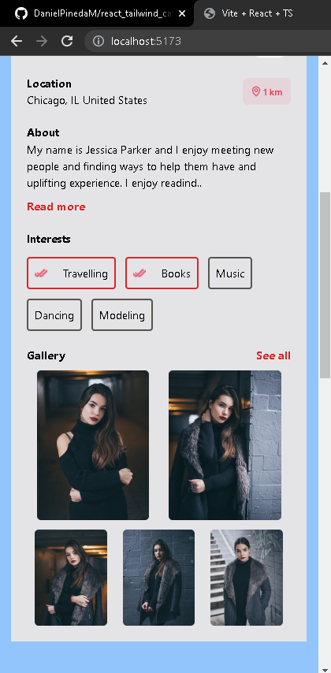
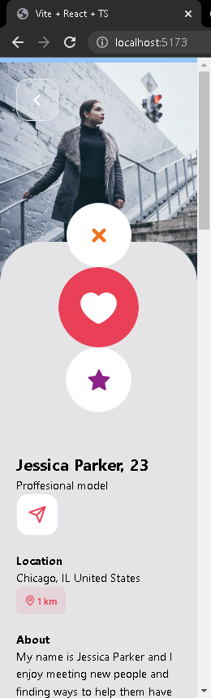
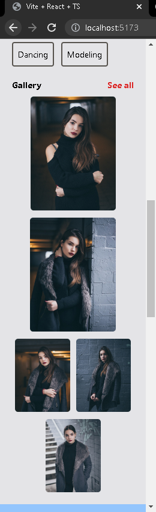

# ***Solución Prueba Tecnica***

## Tecnologías
* [TypeScript](https://www.typescriptlang.org/)
* [ReactJS](https://es.reactjs.org/)
* [ViteJS](https://vitejs.dev/)
* [Tailwind CSS](https://youtu.be/carsqIG6B78)

---

## Tutorial Explicación Proyecto

[https://youtu.be/y338ub1qDhY](https://youtu.be/y338ub1qDhY)

---

## **Enunciado**

**1)** En un caso dado de uso de useReducer, necesitamos actualizar una **propiedad de un objeto** perteneciente al estado inicial de la aplicación, seleccionar la solución correcta.

**2)** En un caso de uso dado de useReducer, necesitamos actualizar un **elemento de un array** perteneciente al estado inicial de la aplicación, seleccionar la solución correcta.

## **Respuesta 1) y 2)**

Los enunciados **1)** y **2)** tienen los mismos Hooks (a, b, c). La unica diferencia es que **1)** pide actualizar **propiedad de un objeto**, en cambio **2)** actualizar **elemento de un array**. 

Todos los Hooks actualizan el objeto o array, la diferencia es:
* ¿como lo actualizan?.
* ¿para que usarlos?.

Para explicar esto, tengo este objeto que actualizaré:



**a.** Reemplazar propiedad objeto `tours` TOTALMENTE con nuevos datos, usar cuando el objeto tiene datos y quiero reemplazar todos los datos existentes del objeto.
```javascript
const reducerA = (state: AppState, action: Action) => {
  switch (action.type) {
    case 'SET_TOURS':
     return { ...state, tours: action.payload }
    default:
     return state
  }
}
```

Se reemplazan todos los datos de `tours`



**b.** Agregar UN NUEVO elemento a propiedad objeto `tours`, usar cuando quiero guardar nueva información.
```javascript
const reducerB = (state: AppState, action: Action) => {
  switch (action.type) {
   case 'SET_TOURS':
    return { ...state, tours: [...state.tours, action.payload] }
   default:
    return state
  }
}
```
Cada vez que se presiona boton 'Agregar tour', hay un contador que va sumando el numero de nuevos `tours` que se agregan: tour 1, tour 2, etc...



**c.** Buscar propiedad objeto por ID y reemplazar una sola propiedad existente en ESPECIFICO, usar cuando existe información en el objeto y quiero reemplazar un dato en especifico
```javascript
// Funcion flecha
const reducerC = (state: ActivityState, action: Action) => {
    // Abrir switch
  switch (action.type) {
    // SI action.type = 'SET_TOURS' entonces...
   case 'EDIT_ACTIVITY':
    /* mapear para iterar objeto 
    y reemplazar propiedad objeto */
    return {
     ...state,
     activities:
      state.activities.map((activity) => activity.id === action.payload.id ?
        { ...action.payload } : activity
     )
    }
   /* cuando NO se encuentra 
   action.type = 'SET_TOURS' 
   devolver el mismo objeto */
   default:
    return state
  }
}
```

Buscar `id: 1` y modificar la propiedad `tours`



---

## **Enunciado**

**3)** Utilice React y Tailwind para maquetar la siguiente Card:

[https://www.figma.com/community/file/1105813760130731100](https://www.figma.com/community/file/1105813760130731100)


## **Respuesta 3)**

Imagenes de la maquetacion de la card en React y Tailwind:








